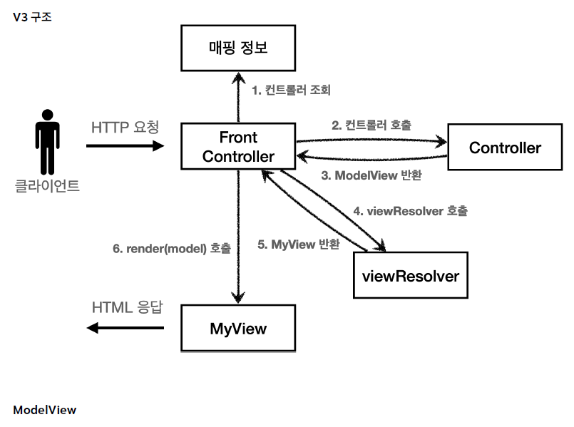

 ## MVC 프론트 컨트롤러 v3
 
 ### ☑️ v2 의 문제점.  
 각 컨트롤러는 메서드에 불필요한 `HttpServletRequest`, `HttpServletResponse` 를 갖고 있다.  
 request 가 가진 정보를 Map 에 담아 전달하면 컨트롤러는 서블릿을 몰라도 동작할 수 있을 것이다.  
 현재의 컨트롤러가 더 이상 서블릿에 의존하지 않도록 변경해보자. 이렇게 하면 코드의 복잡성이 줄어들고 테스트 코드 작성도 쉬울 것이다.
 
 컨트롤러에서 사용하는 viewPath 에도 중복이 존재한다.  
 컨트롤러는 뷰의 논리적 이름을 반환하고, 실제 물리적 위치 이름은 프론트 컨트롤러에서 처리하도록 하자.  
 이렇게 변경하면 향후 뷰의 패키지가 바뀌어도 프론트 컨트롤러만 수정하면 된다.
 
 v3 구조에서는 ModelView 객체를 도입하여 서블릿에 대한 의존성과 뷰 생성을 변경해본다.



 #### 1) ModelView 클래스
 `HttpServletRequest` 대신 데이터와 view 이름을 저장하~는 Model 객체를 만들자.

```java
public class ModelView {
  
  // 뷰 경로를 저장하는 viewName
  private String viewName;
  // request 의 데이터를 담는 model
  private Map<String, Object> model = new HashMap<>();

  public ModelView(String viewName) {
    this.viewName = viewName;
  }

  public String getViewName() {
    return viewName;
  }

  public void setViewName(String viewName) {
    this.viewName = viewName;
  }

  public Map<String, Object> getModel() {
    return model;
  }

  public void setModel(Map<String, Object> model) {
    this.model = model;
  }
}
```
 #### 2) ModelView 를 반환하는 컨트롤러

 이제 컨트롤러는 Map 에 담긴 요청 데이터를 사용해 요청을 처리하고  
 사용자에게 보여줘야 하는 뷰와 데이터를 가진 ModelView 객체를 만들어 반환한다.

```java
public interface ControllerV3 {

  ModelView process(Map<String, String> paramMap);

}
```

```java
public class MemberSaveControllerV3 implements ControllerV3 {

  private MemberRepository memberRepository = MemberRepository.getInstance();

  @Override
  public ModelView process(Map<String, String> paramMap) {

    String username = paramMap.get("username");
    int age = Integer.parseInt(paramMap.get("age"));

    Member member = new Member(username, age);

    memberRepository.save(member);
    ModelView mv = new ModelView("save-result");
    mv.getModel().put("member", member);
    return mv;
  }
}
```

 #### 3) Front Controller
 프론트 컨트롤러는 이제 request 에 담긴 데이터를 Map 담아서 각 컨트롤러에게 전달한다.  
 컨트롤러는 Map 데이터를 이용해 사용자가 요청한 처리(저장, 조회)를 수행하고 사용자에게 처리결과로 보여줄 view 이름까지 지정한 뒤,  
 이것을 `ModelView` 객체로 생성해 프론트 컨트롤러에게 다시 반환한다. 

 마지막으로, 프론트 컨트롤러는 각 컨트롤러가 반환한 `ModelView` 에서 view 이름을 꺼내, MyView 를 호출한다.

```java
@WebServlet(name = "frontControllerServletV3", urlPatterns = "/front-controller/v3/*")
public class FrontControllerServletV3 extends HttpServlet {

  private Map<String, ControllerV3> controllerMap = new HashMap<>();

  public FrontControllerServletV3() {
    controllerMap.put("/front-controller/v3/members/new-form", new MemberFormControllerV3());
    controllerMap.put("/front-controller/v3/members/save", new MemberSaveControllerV3());
    controllerMap.put("/front-controller/v3/members", new MemberListControllerV3());
  }

  @Override
  protected void service(HttpServletRequest request, HttpServletResponse response) throws ServletException, IOException {

    System.out.println("FrontControllerServletV3.service call");

    String requestURI = request.getRequestURI();
    ControllerV3 controller = controllerMap.get(requestURI);

    if (controller == null) {
      response.setStatus(HttpServletResponse.SC_FOUND);
      return;
    }

    //paramMap
    Map<String, String> paramMap = createParamMap(request);

    ModelView mv = controller.process(paramMap);
    String viewName = mv.getViewName();

    MyView myView = viewResolver(viewName);

    myView.render(mv.getModel(), request, response);
  }

  private MyView viewResolver(String viewName) {
    return new MyView("/WEB-INF/views/" + viewName + ".jsp");
  }

  private Map<String, String> createParamMap(HttpServletRequest request) {
    Map<String, String> paramMap = new HashMap<>();

    request.getParameterNames().asIterator()
        .forEachRemaining(paramName -> paramMap.put(paramName, request.getParameter(paramName)));
    return paramMap;
  }

}
```
 ☑️ 뷰리졸버(viewResolver)  
 `MyView view = viewResolver(viewName);`  
 뷰 리졸버는 컨트롤러가 반환한 논리적 view 이름을 실제 물리적 view 경로로 변경한다.
 - 논리 뷰 이름: save-result
 - 물리 뷰 경로: /WEB-INF/views/save-result.jsp


 

 
