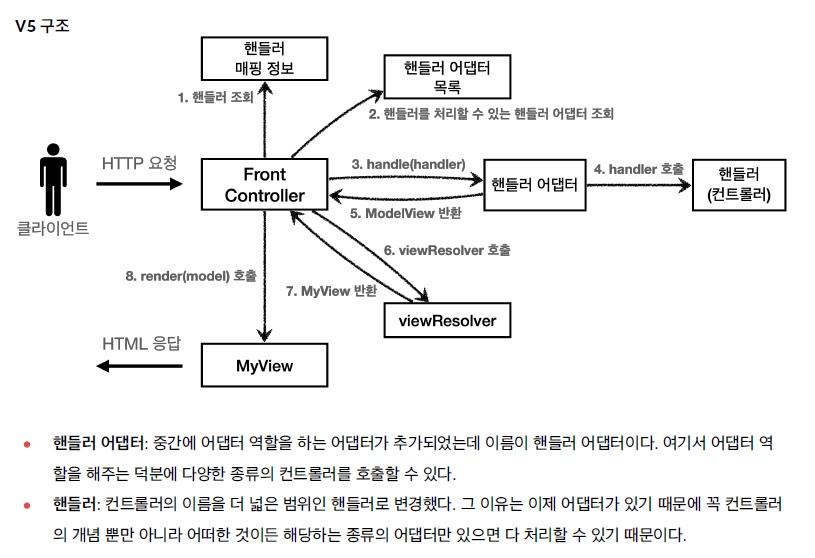

 ## mvc 프론트 컨트롤러 v5
 
 앞서 프론트 컨트롤러 코드를 보면,

 ```java
@WebServlet(name = "frontControllerServletV3", urlPatterns = "/front-controller/v3/*")
public class FrontControllerServletV3 extends HttpServlet {

  private Map<String, ControllerV3> controllerMap = new HashMap<>();

}
``` 
 이 프론트 컨트롤러는 ControllerV3 타입의 컨트롤러만 호출할 수 있다. 인터페이스가 ControllerV3 타입이기 때문에,       
 아무리 많은 컨트롤러가 있다고 해도 ControllerV3 를 구현한 컨트롤러만 사용할 수 있는 것이다.

 이러한 문제를 해결하기 위해 프론트 컨트롤러에서 바로 컨트롤러를 호출하는 대신 핸들러 어댑터를 도입해보자.  
 핸들러 어댑터는 프론트 컨트롤러와 핸들러 사이에서 중간 계층 역할을 한다.  
 프론트 컨트롤러는 핸들러의 구체 타입을 몰라도 되고, 각 핸들러 타입에 맞는 어댑터가 호출 방식을 맞춰준다.

 ❗단, 새로운 타입의 핸들러를 사용하려면 그 타입을 지원하는 HandlerAdapter 구현체도 추가되어야 한다.  


 


 ### 1) HandlerAdapter

 ☑️ 일단 핸들러 어댑터를 바로 만들기 전에, 핸들러 어댑터는 이렇게 만들어야 한다는 규칙(인터페이스)를 만들어 보자.  

```java
public interface MyHandlerAdapter {
  
  // 핸들러 어댑터는 전달받은 핸들러(컨트롤러)가 자신과 맞는지 확인해야 한다.
  boolean supports(Object handler);
  
  // 핸들러(컨트롤러)를 호출해 요청 처리를 지시한다.
  ModelView handle(HttpServletRequest request , HttpServletResponse response, Object handler);

}
```

 이제 핸들러 어댑터를 만들어보자. 주의할 것은, 하나의 핸들러 어댑터로 모든 컨트롤러를 다루는 것이 아니다.  
 자바 문법에 따라 핸들러 어댑터 역시 다룰 수 있는 컨트롤러의 타입은 정해져 있다.  
 따라서 다른 타입의 컨트롤러가 추가된다면 해당 컨트롤러와 맞는 별도의 핸들러 어댑터를 추가해야 한다.  

 ☑️ 우선 ControllerV3 타입의 모든 컨트롤러를 호출할 수 있는 핸들러 어댑터를 만들어보자.

```java
public class ControllerV3HandlerAdapter implements MyHandlerAdapter {

  @Override
  public boolean supports(Object handler) {
    
    // ControllerV3 타입의 컨트롤러만 담당하기에 전달된 핸들러가 ControllerV3 타입이 맞는지 확인한다.
    return handler instanceof ControllerV3;
  }

  @Override
  public ModelView handle(HttpServletRequest request, HttpServletResponse response, Object handler) {
   
    // 위의 supports 메서드가 true 라면 전달된 handler 는 ControllerV3 로 캐스팅이 가능하다. 
    ControllerV3 controller = (ControllerV3) handler;
    
    // 이제 프론트 컨트롤러가 아닌 핸들러 어댑터에서 컨트롤러를 호출한다.
    Map<String, String> paramMap = createParamMap(request);
    ModelView mv = controller.process(paramMap);

    return mv;
  }

  private Map<String, String> createParamMap(HttpServletRequest request) {
    Map<String, String> paramMap = new HashMap<>();

    request.getParameterNames().asIterator()
        .forEachRemaining(paramName -> paramMap.put(paramName, request.getParameter(paramName)));
    return paramMap;
  }
}
```

 ### 2) FrontControllerServletV5

이제 프론트 컨트롤러는 핸들러(컨트롤러)와 핸들러 어댑터 목록을 가지고 있되,  
핸들러를 직접 호출하지 않고, 해당 핸들러를 지원하는 핸들러 어댑터를 찾아 호출을 위임한다.  
 
 ☑️ 이제 프론트 컨트롤러는 다양한 타입의 컨트롤러를 사용할 수 있다.

```java
@WebServlet(name = "frontControllerV5", urlPatterns = "/front-controller/v5/*")
public class FrontControllerV5 extends HttpServlet {
  
  // 핸들러(컨트롤러) 집합
  private final Map<String, Object> handlerMappingMap = new HashMap<>();
  
  // 핸들러 어댑터 집합
  private final List<MyHandlerAdapter> handlerAdapters = new ArrayList<>();

  public FrontControllerV5() {
    initHandlerMappingMap();
    initHandlerAdapters();
  }

  private void initHandlerMappingMap() {
    handlerMappingMap.put("/front-controller/v5/v3/members/new-form", new MemberFormControllerV3());
    handlerMappingMap.put("/front-controller/v5/v3/members/save", new MemberSaveControllerV3());
    handlerMappingMap.put("/front-controller/v5/v3/members", new MemberListControllerV3());
  }

  private void initHandlerAdapters() {
    handlerAdapters.add(new ControllerV3HandlerAdapter());
  }

  @Override
  protected void service(HttpServletRequest request, HttpServletResponse response) throws ServletException, IOException {

    System.out.println("FrontControllerServletV5.service call");
    
    // URI 요청을 분석해 알맞은 핸들러(컨트롤러)를 찾는다.
    Object handler = getHandler(request);

    if (handler == null) {
      response.setStatus(HttpServletResponse.SC_FOUND);
      return;
    }
    
    // 핸들러를 찾았다면 바로 핸들러를 호출하는 것이 아니라,
    // 해당 핸들러를 다룰 수 있는 핸들러 어댑터를 다시 찾아야 한다.
    MyHandlerAdapter adapter = getMyHandlerAdapter(handler);
   
    // 프론트 컨트롤러는 핸들러 어댑터를 통해 핸들러를 호출하게 된다.
    ModelView mv = adapter.handle(request, response, handler);

    String viewName = mv.getViewName();
    MyView myView = viewResolver(viewName);

    myView.render(mv.getModel(), request, response);
  }

  private MyHandlerAdapter getMyHandlerAdapter(Object handler) {
    for (MyHandlerAdapter handlerAdapter : handlerAdapters) {
      if (handlerAdapter.supports(handler)) {
        return handlerAdapter;
      }
    }
    throw new IllegalArgumentException("handler adapter 를 찾을 수 없습니다. handler = " + handler);
  }

  private Object getHandler(HttpServletRequest request) {
    String requestURI = request.getRequestURI();
    return handlerMappingMap.get(requestURI);
  }

  private MyView viewResolver(String viewName) {
    return new MyView("/WEB-INF/views/" + viewName + ".jsp");
  }
}
```

 ☑️ 정리  
 위 코드에서는 아직 ControllerV3 타입의 컨트롤러만 다루고 있기에, 어댑터 계층이 추가된 것이 구체적으로 어떤 결과를 가져오는지 체감되지 않는다.  
 그러나 ControllerV3 외에도 다른 타입의 컨트롤러가 필요한 상황이 된다면 이와 같은 구조는 강력한 확장성을 보여줄 수 있다.

