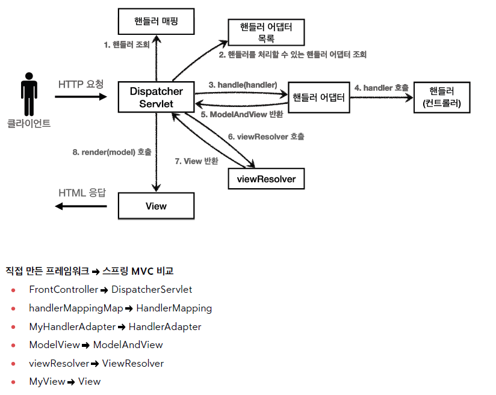

## 스프링 MVC 전체 구조

지난 챕터에서 만든 V5 프레임워크와 실제 스프링 MVC를 비교해보자.

☑️ 직접 만든 MVC 프레임워크 구조


☑️ Spring MVC 구조



우리가 만들었던 V5 구조와 스프링 MVC 프레임워크는 비슷한 구조를 가지고 있다.  
핵심 아이디어(프론트 컨트롤러, 핸들러 매핑, 어댑터, 뷰 처리)는 동일하지만,  
스프링 MVC는 훨씬 더 다양한 전략과 확장 구조를 포함한 고도화된 형태라고 볼 수 있다.

---

### 1) DispatcherServlet 구조 살펴보기

스프링 MVC 프레임워크 역시 프론트 컨트롤러 패턴으로 구현되어 있다.  
스프링 MVC의 프론트 컨트롤러가 바로 `DispatcherServlet`이다.  
그리고 이 `DispatcherServlet`이 스프링 MVC의 핵심이다.

이 `DispatcherServlet`은 단순히 요청을 전달하는 것이 아니라,  
`HandlerMapping`, `HandlerAdapter`, `ViewResolver` 등 다양한 전략 인터페이스를 조합하여  
전체 요청 처리 흐름을 제어하는 중심 컴포넌트이다.

---

#### - DispatcherServlet 등록

`DispatcherServlet` 역시 부모 클래스에서 `HttpServlet`을 상속받아 서블릿으로 동작한다.

- `DispatcherServlet` → `FrameworkServlet` → `HttpServletBean` → `HttpServlet`

☑️ Spring Boot는 `DispatcherServlet`을 자동으로 등록하고, 기본적으로 `"/"` 경로에 매핑하여 모든 요청을 처리하도록 한다.

❗ 그러나 `DispatcherServlet`보다 더 구체적인 URL 패턴으로 매핑된 서블릿이 존재하면,  
서블릿 매핑 규칙에 따라 해당 서블릿이 우선적으로 요청을 처리한다.

---

☑️ 요청 흐름

- 서블릿이 호출되면 `HttpServlet`이 제공하는 `service()`가 호출된다.
- 스프링 MVC는 `DispatcherServlet`의 부모인 `FrameworkServlet`에서 `service()`를 재정의해 두었다.
- `FrameworkServlet.service()`를 시작으로 여러 메서드가 호출되면서 `DispatcherServlet.doDispatch()`가 호출된다.

`DispatcherServlet`의 핵심인 `doDispatch()` 코드를 분석해보자.

`doDispatch()`는 `DispatcherServlet`의 핵심 메서드로, 요청 처리의 전체 흐름(핸들러 조회 → 실행 → 뷰 렌더링)을 담당한다.

```java
public class DispatcherServlet extends FrameworkServlet {

 // 모든 코드를 다 볼 수는 없고, 핵심 기능만 간추려 본다.
 protected void doDispatch(HttpServletRequest request, HttpServletResponse response) throws Exception {

  HttpServletRequest processedRequest = request;
  HandlerExecutionChain mappedHandler = null;
  ModelAndView mv = null;

  // 1. 핸들러 조회 - 핸들러 매핑을 통해 요청 URL에 매핑된 핸들러(컨트롤러)를 조회한다.
  mappedHandler = getHandler(processedRequest);

  if (mappedHandler == null) {
   noHandlerFound(processedRequest, response);
   return;
  }

  // 2. 핸들러 어댑터 조회 - 핸들러를 실행할 수 있는 어댑터 조회
  HandlerAdapter ha = getHandlerAdapter(mappedHandler.getHandler());

  // 3. 핸들러 어댑터를 통해 핸들러 실행
  // 4. ModelAndView 반환
  mv = ha.handle(processedRequest, response, mappedHandler.getHandler());

  processDispatchResult(processedRequest, response, mappedHandler, mv, dispatchException);
 }

 private void processDispatchResult(HttpServletRequest request, HttpServletResponse response,
         @Nullable HandlerExecutionChain mappedHandler, @Nullable ModelAndView mv,
         @Nullable Exception exception) throws Exception {

  // 5. 뷰 렌더링 호출
  render(mv, request, response);
 }

 protected void render(ModelAndView mv, HttpServletRequest request, HttpServletResponse response) throws Exception {

  String viewName = mv.getViewName();
  View view;

  if (viewName != null) {
   // 6. ViewResolver를 통해 뷰 찾기
   view = this.resolveViewName(viewName, mv.getModelInternal(), locale, request);
  } else {
   view = mv.getView();
  }

  // 7. 뷰 렌더링 시작
  view.render(mv.getModelInternal(), request, response);
 }
}
```

---

#### - 인터페이스 살펴보기

- 스프링 MVC의 가장 큰 강점은 `DispatcherServlet` 코드를 변경하지 않고도 원하는 기능을 변경하거나 확장할 수 있다는 점이다.
- 이러한 인터페이스들을 구현하여 `DispatcherServlet`에 등록하면 나만의 컨트롤러를 만들 수도 있다.

---

#### - 주요 인터페이스 목록

- 핸들러 매핑: `org.springframework.web.servlet.HandlerMapping`
- 핸들러 어댑터: `org.springframework.web.servlet.HandlerAdapter`
- 뷰 리졸버: `org.springframework.web.servlet.ViewResolver`
- 뷰: `org.springframework.web.servlet.View`

---

☑️ 정리

스프링 MVC 프레임워크는 코드 분량도 매우 많고 복잡하여 내부 구조를 모두 파악하는 것은 쉽지 않다.  
그러나 이러한 기능을 직접 확장하거나 나만의 컨트롤러를 만드는 일은 일반적으로 필요하지 않다.

왜냐하면 스프링 MVC는 전 세계 수많은 개발자들의 요구사항을 반영하여  
웹 애플리케이션 개발에 필요한 대부분의 기능을 이미 제공하고 있기 때문이다.

그럼에도 불구하고 이러한 핵심 동작 방식을 이해해 두면, 문제가 발생했을 때 원인을 빠르게 파악하고 해결하는 데 큰 도움이 된다.  
또한, 확장 포인트가 필요한 경우 어디서부터 확장해야 할지 판단할 수 있다.

결국 스프링 MVC는 다양한 전략 인터페이스를 조합하여 유연하고 확장 가능한 웹 요청 처리 구조를 제공한다.