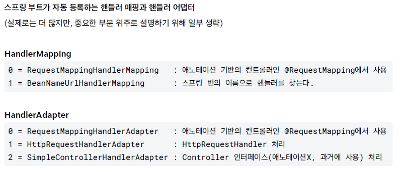

## 🧠 스프링 MVC의 HandlerMapping과 HandlerAdapter

스프링 MVC는 `DispatcherServlet`이라는 프론트 컨트롤러를 중심으로 동작하며,  
이 컴포넌트를 통해 다양한 핸들러 매핑과 핸들러 어댑터를 활용해 요청을 처리한다.

그렇다면 스프링 MVC 내부에서는  
핸들러 매핑과 핸들러 어댑터가 어떻게 동작할까?

---

## 1️⃣ 핸들러 매핑과 핸들러 어댑터의 동작 구조

현재는 거의 사용되지 않는 레거시 `Controller` 인터페이스를 직접 구현해보며  
스프링 MVC의 내부 동작 구조를 이해해보자.

---

## 📌 CASE 1. 레거시 Controller 인터페이스

```java
@FunctionalInterface
public interface Controller {
  @Nullable
  ModelAndView handleRequest(HttpServletRequest request, HttpServletResponse response) throws Exception;
}
```

이 인터페이스는 스프링 초기 버전에서 제공된 컨트롤러 방식이다.  
개발자는 이 인터페이스를 구현하고 `handleRequest()` 메서드를 통해 요청을 처리했다.

---

### 📌 레거시 컨트롤러 구현

```java
// 스프링 빈 이름이 URL로 사용됨
@Component("/springmvc/old-controller")
public class OldController implements Controller {

  @Override
  public ModelAndView handleRequest(HttpServletRequest request, HttpServletResponse response) {
    System.out.println("OldController.handleRequest");
    return null;
  }
}
```

---

## 2️⃣ 핸들러 실행을 위한 조건

이 컨트롤러가 정상적으로 동작하려면 다음 두 가지가 필요하다.

### ☑️ 1. HandlerMapping
- 요청 URL에 해당하는 핸들러를 찾아야 한다.
- 이 경우, 스프링 빈 이름을 기반으로 핸들러를 찾는 `BeanNameUrlHandlerMapping`이 필요하다.

---

### ☑️ 2. HandlerAdapter
- 찾은 핸들러를 실제로 실행할 수 있어야 한다.
- `OldController`는 `Controller` 인터페이스를 구현했으므로 이를 호출할 수 있는 `SimpleControllerHandlerAdapter`가 필요하다.

---

❗ 스프링 MVC는 다양한 방식의 컨트롤러를 지원하기 위해  
여러 종류의 `HandlerMapping`과 `HandlerAdapter`를 이미 구현해두고 있다.



---

## 3️⃣ 요청 처리 흐름 (CASE 1)

### 1. 핸들러 조회
- `DispatcherServlet`이 `HandlerMapping`을 순서대로 실행한다.
- `BeanNameUrlHandlerMapping`이 동작하여 `/springmvc/old-controller`에 해당하는 `OldController`를 찾는다.

---

### 2. 핸들러 어댑터 조회
- `DispatcherServlet`은 해당 핸들러를 처리할 수 있는 `HandlerAdapter`를 찾는다.
- 각 어댑터의 `supports()` 메서드를 통해 지원 여부를 확인한다.
- `SimpleControllerHandlerAdapter`가 선택된다.

---

### 3. 핸들러 실행
- `DispatcherServlet`이 `SimpleControllerHandlerAdapter`를 호출한다.
- 어댑터는 내부에서 `OldController.handleRequest()`를 실행한다.
- 실행 결과인 `ModelAndView`를 반환한다.

---

## 📌 최종 정리 (CASE 1)

`OldController` 실행에 사용된 구성 요소:

- **HandlerMapping**
  → `BeanNameUrlHandlerMapping`

- **HandlerAdapter**
  → `SimpleControllerHandlerAdapter`

---

## 📌 CASE 2. 레거시 HttpRequestHandler 인터페이스

스프링이 제공하는 다른 인터페이스도 구현하여 한번 더 확인해보자.  
`HttpRequestHandler`는 서블릿과 가장 유사한 형태의 핸들러이다.

```java
@FunctionalInterface
public interface HttpRequestHandler {
  void handleRequest(HttpServletRequest request, HttpServletResponse response) throws ServletException, IOException;
}
```

---

### 📌 레거시 컨트롤러 구현

```java
@Component("/springmvc/request-handler")
public class MyHttpRequestHandler implements HttpRequestHandler {

  @Override
  public void handleRequest(HttpServletRequest request, HttpServletResponse response) throws ServletException, IOException {
    System.out.println("MyHttpRequestHandler.handleRequest");
  }
}
```

이 핸들러 역시 구현한 인터페이스 타입만 다를 뿐,  
`OldController`와 동일한 실행 과정을 거친다.

---

## 3️⃣ 요청 처리 흐름 (CASE 2)

### 1. 핸들러 조회
- `DispatcherServlet`이 `HandlerMapping`을 순서대로 실행한다.
- `BeanNameUrlHandlerMapping`이 동작하여 `/springmvc/request-handler`에 해당하는 `MyHttpRequestHandler`를 찾는다.

---

### 2. 핸들러 어댑터 조회
- `DispatcherServlet`은 해당 핸들러를 처리할 수 있는 `HandlerAdapter`를 찾는다.
- 각 어댑터의 `supports()` 메서드를 통해 지원 여부를 확인한다.
- `HttpRequestHandlerAdapter`가 `HttpRequestHandler` 인터페이스를 지원하므로 선택된다.

---

### 3. 핸들러 실행
- `DispatcherServlet`이 `HttpRequestHandlerAdapter`를 호출한다.
- 어댑터는 내부에서 `MyHttpRequestHandler.handleRequest()`를 실행한다.
- 이 경우 별도의 `ModelAndView`를 반환하지 않고, 직접 응답을 처리한다.

---

## 📌 최종 정리 (CASE 2)

`MyHttpRequestHandler` 실행에 사용된 구성 요소:

- **HandlerMapping**
  → `BeanNameUrlHandlerMapping`

- **HandlerAdapter**
  → `HttpRequestHandlerAdapter`

---

## 4️⃣ 현재 스프링에서 사용하는 방식

현재 스프링 웹 개발에서는 위의 레거시 인터페이스 대신  
`RequestMappingHandlerMapping`과 `RequestMappingHandlerAdapter`를 사용한다.

이 구성 요소들은 `@RequestMapping`을 포함한 어노테이션 기반 매핑 정보를 해석하여  
컨트롤러를 연결하고 실행하는 역할을 한다.

👉 실무에서는 이 방식을 사실상 표준으로 사용한다.