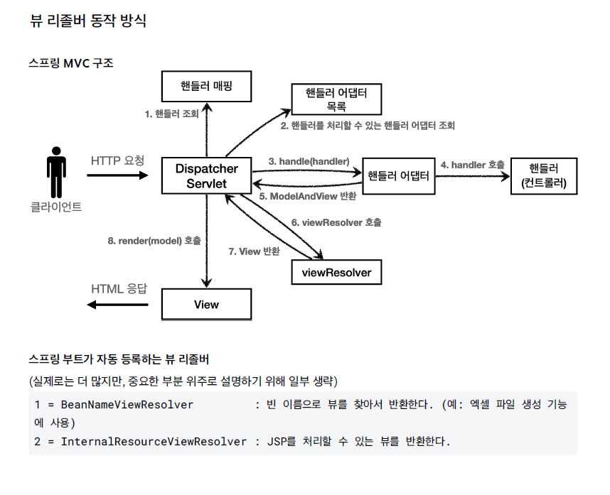

## 스프링 MVC 의 ViewResolver

이번에는 ViewResolver(뷰 리졸버)에 대해 알아보자.
 
---

## 1️⃣ ViewResolver 개념

ViewResolver란, 핸들러로부터 전달받은 ModelAndView의 `뷰 이름(viewName)`을 기반으로  
실제 View 객체를 생성하여 DispatcherServlet에 반환해주는 핵심 컴포넌트이다.

DispatcherServlet은 이 View 객체를 받아 render()를 호출하고,  
최종적으로 뷰의 물리적 경로에 있는 리소스를 찾아 사용자에게 화면을 보여주게 된다.

---

### 📌 예제: OldController 수정

앞서 만들었던 OldController를 조금 변경해보자.

```java
@Component("/springmvc/old-controller")
public class OldController implements Controller {

  @Override
  public ModelAndView handleRequest(HttpServletRequest request, HttpServletResponse response) throws Exception {
    System.out.println("OldController.handleRequest");
    
    // 'new-form' 이라는 논리적 뷰 이름 전달
    return new ModelAndView("new-form");
  }
}
```

그런데 이것만으로는 서버 요청 시 Whitelabel Error Page가 응답된다.

---

### 📌 View 경로 설정

application.properties 파일을 수정하여 prefix와 suffix를 설정한다.

```text
spring.mvc.view.prefix=/WEB-INF/views/
spring.mvc.view.suffix=.jsp
```
 
---

## 2️⃣ ViewResolver - InternalResourceViewResolver

스프링 부트는 InternalResourceViewResolver라는 뷰 리졸버를 자동으로 등록하며,  
이때 application.properties의 설정 정보를 사용한다.

❗경로 설정 없이 ModelAndView 객체에 전체 경로를 전달할 수도 있지만,  
실무에서는 거의 사용되지 않는다.

```java
return new ModelAndView("/WEB-INF/views/new-form.jsp");
```

---

## 3️⃣ ViewResolver 동작 방식



스프링 MVC에서는 핸들러, 핸들러 어댑터와 마찬가지로 다양한 뷰 리졸버를 제공하며,  
상황에 맞는 뷰 리졸버가 선택되어 View 객체를 반환한다.

---

### 📌 동작 흐름

1. 핸들러 어댑터 실행
   - 핸들러를 호출하고 반환값으로 `'new-form'`이라는 논리 뷰 이름을 받는다.

2. ViewResolver 조회 및 선택
   - 뷰 이름 `'new-form'`을 기준으로 ViewResolver가 호출된다.
   - BeanNameViewResolver는 스프링 빈 이름으로 뷰를 찾지만, `'new-form'`에 해당하는 빈이 없기 때문에 선택되지 않는다.
   - 결국 InternalResourceViewResolver가 선택된다.

3. View 객체 생성
   - InternalResourceViewResolver는 InternalResourceView를 반환한다.

4. View 처리 방식
   - InternalResourceView는 JSP처럼 forward()를 호출하여 처리하는 View이다.

5. View 렌더링
   - view.render()가 호출된다.
   - InternalResourceView는 forward()를 사용하여 JSP를 실행한다.

---

## 📌 참고

- InternalResourceViewResolver는 JSTL 라이브러리가 존재하면 InternalResourceView를 상속한 JstlView를 반환한다.  
  - JstlView는 JSTL 태그 사용 시 추가 기능을 제공한다.

- 다른 뷰는 직접 렌더링을 수행하지만,  
  JSP의 경우 forward()를 통해 해당 JSP로 이동(실행)해야 렌더링된다.

- JSP를 제외한 템플릿 엔진(예: Thymeleaf)은 forward() 과정 없이 직접 렌더링을 수행한다.

- Thymeleaf 템플릿 엔진을 사용하는 경우 과거에는 ThymeleafViewResolver를 직접 등록해야 했지만,  
  최근에는 라이브러리만 추가하면 스프링 부트가 자동으로 등록해준다.