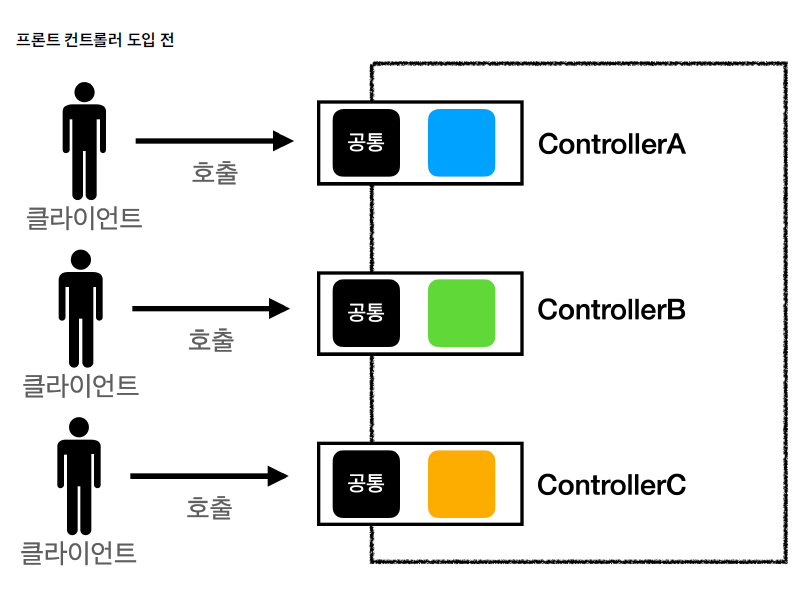
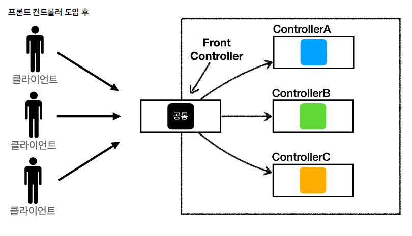

 ## MVC 프론트 컨트롤러 패턴 v1
 
 MVC 패턴의 공통 처리 문제를 해결하기 위한 프론트 컨트롤러 패턴을 만들어보자.




 ☑️ FrontController 의 특징
 - 프론트 컨트롤러 서블릿 하나로 클라이언트의 모든 요청을 다 받음.
 - 프론트 컨트롤러가 요청에 맞는 컨트롤러를 찾아서 호출.
 - 요청이 들어오는 지점을 하나의 진입점으로 만들어 모든 요청을 선처리.
 - 각 컨트롤러에서 중복되는 처리들을 프론트 컨트롤러에서 공통 처리.
 - 프론트 컨트롤러를 제외한 나머지 컨트롤러는 서블릿을 사용하지 않아도 된다.

 ☑️ 스프링 웹 MVC 와 프론트 컨트롤러
 - 스프링 웹 MVC 의 핵심도 이 FrontController 패턴에 있다.
 - 스프링 웹 MVC 의 `DispatcherServlet` 이 바로 이 `FrontController` 패턴으로 구현되어 있음.


 ### 1) 프론트 컨트롤러 패턴 적용하기.

 기존의 코드에 프론트 컨트롤러 패턴을 적용해서 리팩토링 해보자.  
 각 단계마다 점진적으로 코드를 분석하고 변경해나갈수록 프론트 컨트롤러의 의미를 알게 된다.

 ☑️ 우선 다형성을 이용해 모든 컨트롤러의 구조체가 될 수 있는 인터페이스를 만든다.
 
```java
 public interface ControllerV1 { 
   void process(HttpServletRequest request, HttpServletResponse response) throws ServletException, IOException; 
 }
```

 ☑️ 모든 요청을 받을 수 있는 하나의 단일 진입점 서블릿을 만들자.

```java
 // urlPatterns 에 모든 요청을 받을 수 있도록 * 경로를 추가해준다.
 @WebServlet(name = "frontControllerServletV1", urlPatterns = "/front-controller/v1/*")
 public class FrontControllerServletV1 extends HttpServlet {
 
   private Map<String, ControllerV1>  controllerMap = new HashMap<>();
   
   // 이 프론트 컨트롤러는 각각 다른 기능을 가진 컨트롤러 3개를 갖고 있다.
   public FrontControllerServletV1() {
     controllerMap.put("/front-controller/v1/members/new-form", new MemberFormControllerV1());
     controllerMap.put("/front-controller/v1/members/save", new MemberSaveControllerV1());
     controllerMap.put("/front-controller/v1/members", new MemberListControllerV1());
   }
 
   @Override
   protected void service(HttpServletRequest request, HttpServletResponse response) throws ServletException, IOException {
 
     System.out.println("FrontControllerServlet.service call");
      
     // 요청 URI 를 분석하여 해당 요청을 처리할 수 컨트롤러를 호출한다.
     String requestURI = request.getRequestURI();
     ControllerV1 controller = controllerMap.get(requestURI);
 
     if (controller == null) {
       response.setStatus(HttpServletResponse.SC_FOUND);
       return;
     }
 
     controller.process(request, response);
   }
 }
```

 ☑️ 각각의 처리를 담당하는 컨트롤러를 만든다.
 
```java
 // 1. 회원 등록 화면을 보여주는 컨트롤러
 public class MemberFormControllerV1 implements ControllerV1 {

   @Override
   public void process(HttpServletRequest request, HttpServletResponse response) throws ServletException, IOException {
     String viewPath = "/WEB-INF/views/new-form.jsp";
     RequestDispatcher dispatcher = request.getRequestDispatcher(viewPath);
     dispatcher.forward(request, response);
   }
 }
```
```java
 // 2. 회원 저장을 처리하는 컨트롤러
 public class MemberSaveControllerV1 implements ControllerV1 {

   private MemberRepository memberRepository = MemberRepository.getInstance();

   @Override
   public void process(HttpServletRequest request, HttpServletResponse response) throws ServletException, IOException {

     String username = request.getParameter("username");
     int age = Integer.parseInt(request.getParameter("age"));

     Member member = new Member(username, age);
     memberRepository.save(member);

     // Model 에 데이터를 보관한다.
     request.setAttribute("member", member);

     String viewPath = "/WEB-INF/views/save-result.jsp";
     RequestDispatcher dispatcher = request.getRequestDispatcher(viewPath);
     dispatcher.forward(request, response);
   }
 }
```

```java
 // 3. 전체 회원 조회를 처리하는 컨트롤러
 public class MemberListControllerV1 implements ControllerV1 {

   private MemberRepository memberRepository = MemberRepository.getInstance();

   @Override
   public void process(HttpServletRequest request, HttpServletResponse response) throws ServletException, IOException {

     List<Member> members = memberRepository.findAll();

     request.setAttribute("members", members);

     String viewPath = "/WEB-INF/views/members.jsp";
     RequestDispatcher dispatcher = request.getRequestDispatcher(viewPath);
     dispatcher.forward(request, response);

   }
 }
```

 ☑️ 정리하자면, 과거에는 회원 등록 화면, 회원 저장, 전체 회원 조회 등 각 요청에 따라 여러 개의 서블릿을 만들어야 했다.  
 하지만 프론트 컨트롤러 패턴을 통해 단일 진입점을 만듦으로써, 서블릿 하나만으로 모든 요청을 받을 수 있게 되었고  
 서블릿에서 요청을 분석하여 각 하위 컨트롤러로 요청 처리를 위임하게 된다.

