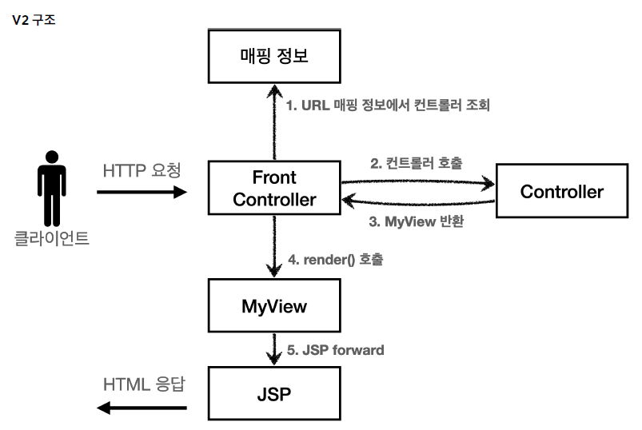

 
 ## MVC 프론트 컨트롤러 패턴 v2
 
 앞서 만든 컨트롤러 v1 을 잘 살펴보면, 각 컨트롤러 마다 다음과 같은 중복 코드를 가진다.
 
 ```java
  String viewPath = "...";
  RequestDispatcher dispatcher = request.getRequestDispatcher(viewPath);
  dispatcher.forward(request, response);
```
 
 이러한 중복 코드를 제거할 수 없을까?  
 뷰를 전담 처리하는 객체를 만들어 분리해보자.



 ### 1) ☑️ MyView 클래스 생성.  
 MyView 클래스는 viewPath 와 forward 를 맡아 처리한다. 

```java
  public class MyView {

   private String viewPath;

   public MyView(String viewPath) {
     this.viewPath = viewPath;
   }

   public void render(HttpServletRequest request, HttpServletResponse response) throws ServletException, IOException {
     RequestDispatcher dispatcher = request.getRequestDispatcher(viewPath);
     dispatcher.forward(request, response);
   }
 }
```

 ### 2) ☑️ 각 컨트롤러의 중복 코드를 제거하고, 프론트 컨트롤러에서 render() 호출.

```java
public class MemberFormControllerV2 implements ControllerV2 {

  @Override
  public MyView process(HttpServletRequest request, HttpServletResponse response) throws ServletException, IOException {
    return new MyView("/WEB-INF/views/new-form.jsp");
  }
}
```

```java
@WebServlet(name = "frontControllerServletV2", urlPatterns = "/front-controller/v2/*")
public class FrontControllerServletV2 extends HttpServlet {

  private Map<String, ControllerV2> controllerMap = new HashMap<>();

  public FrontControllerServletV2() {
    controllerMap.put("/front-controller/v2/members/new-form", new MemberFormControllerV2());
    controllerMap.put("/front-controller/v2/members/save", new MemberSaveControllerV2());
    controllerMap.put("/front-controller/v2/members", new MemberListControllerV2());
  }

  @Override
  protected void service(HttpServletRequest request, HttpServletResponse response) throws ServletException, IOException {

    System.out.println("FrontControllerServletV2.service call");

    String requestURI = request.getRequestURI();
    ControllerV2 controller = controllerMap.get(requestURI);

    if (controller == null) {
      response.setStatus(HttpServletResponse.SC_FOUND);
      return;
    }

    MyView view = controller.process(request, response);
    view.render(request, response);
  }

}
```
 ### 3) ☑️ 정리  
 - 이제 각 컨트롤러는 복잡한 `dispatcher.forward()` 를 직접 생성해서 호출하지 않아도 된다.  
 - 컨트롤러는 그저 뷰를 담당하는 MyView 객체를 생성한뒤 반환해주면 된다.
 - 프론트 컨트롤러가 MyView 객체의 render() 를 호출하여 화면을 처리한다.

 

