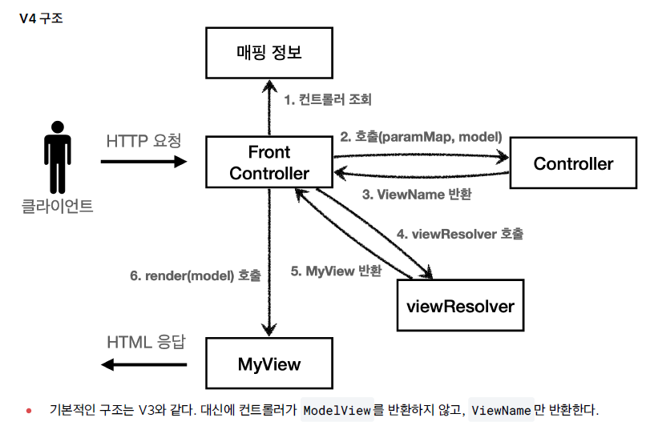

 ## MVC 프론트 컨트롤러 v4
 
 v1, v2 , v3.. 각 버전이 올라감에 따라 점점 컨트롤러가 개선되고 있지만,  
 그럼에도 아직 문제가 남아 있다.  

 예를 들어, 컨트롤러에서 매번 ModelView 객체를 생성하고 반환해야 하는 부분은 번거롭다.  
 좋은 프레임워크는 아키텍처도 중요하지만, 그와 더불어 실제 개발하는 개발자가 단순하고 편리하게  
 사용할 수 있는 실용성이 있어야 한다.  

 

 이제는 컨트롤러가 ModelView 가 아닌 view 이름만 반환한다.   
 model 객체는 프론트 컨트롤러에서 생성되어 메서드의 인자로 컨트롤러에게 전달되는 것이다.
 
 ### 1) viewName 만 반환하는 컨트롤러

```java
public interface ControllerV4 {

  /**
   *
   * @param paramMap
   * @param model
   * @return viewName
   */
  String process(Map<String, String> paramMap, Map<String, Object> model);

}
```

```java
public class MemberSaveControllerV4 implements ControllerV4 {

  private MemberRepository memberRepository = MemberRepository.getInstance();

  @Override
  public String process(Map<String, String> paramMap, Map<String, Object> model) {
    // 대신 메서드 파라미터에 model을 추가하여 사용자에게 보여줄 데이터를 담는다.
    
    String username = paramMap.get("username");
    int age = Integer.parseInt(paramMap.get("age"));

    Member member = new Member(username, age);
    memberRepository.save(member);

    model.put("member", member);
    
    // 컨트롤러는 이제 viewName 만 반환하면 된다.
    return "save-result";
  }
}
```

 ### 2) 요청 데이터와 모델 데이터를 모두 갖는 프론트 컨트롤러

```java
@WebServlet(name = "frontControllerServletV4", urlPatterns = "/front-controller/v4/*")
public class FrontControllerServletV4 extends HttpServlet {

  private Map<String, ControllerV4> controllerMap = new HashMap<>();

  public FrontControllerServletV4() {
    controllerMap.put("/front-controller/v4/members/new-form", new MemberFormControllerV4());
    controllerMap.put("/front-controller/v4/members/save", new MemberSaveControllerV4());
    controllerMap.put("/front-controller/v4/members", new MemberListControllerV4());
  }

  @Override
  protected void service(HttpServletRequest request, HttpServletResponse response) throws ServletException, IOException {

    System.out.println("FrontControllerServletV4.service call");

    String requestURI = request.getRequestURI();
    ControllerV4 controller = controllerMap.get(requestURI);

    if (controller == null) {
      response.setStatus(HttpServletResponse.SC_FOUND);
      return;
    }

    //paramMap: 요청에서 전달된 데이터
    Map<String, String> paramMap = createParamMap(request);

    //model 생성: 요청 처리후 사용자에게 화면을 보여줄때 필요한 데이터
    HashMap<String, Object> model = new HashMap<>();
    String viewName = controller.process(paramMap, model);

    MyView myView = viewResolver(viewName);

    myView.render(model, request, response);
  }

  private MyView viewResolver(String viewName) {
    return new MyView("/WEB-INF/views/" + viewName + ".jsp");
  }

  private Map<String, String> createParamMap(HttpServletRequest request) {
    Map<String, String> paramMap = new HashMap<>();

    request.getParameterNames().asIterator()
        .forEachRemaining(paramName -> paramMap.put(paramName, request.getParameter(paramName)));
    return paramMap;
  }

}
```

 이번 v4 에서의 변경점은 그렇게 많지 않다.  
 그러나 기존의 ModelView 객체를 분리하여 model 과  view 로 나눈 것만으로도 컨트롤러의 의존성을 줄이고 코드의 가독성을 높혔다.


 
 

 

 
 